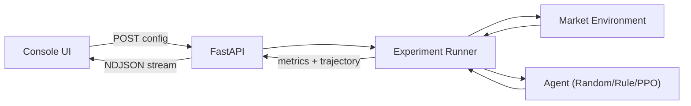
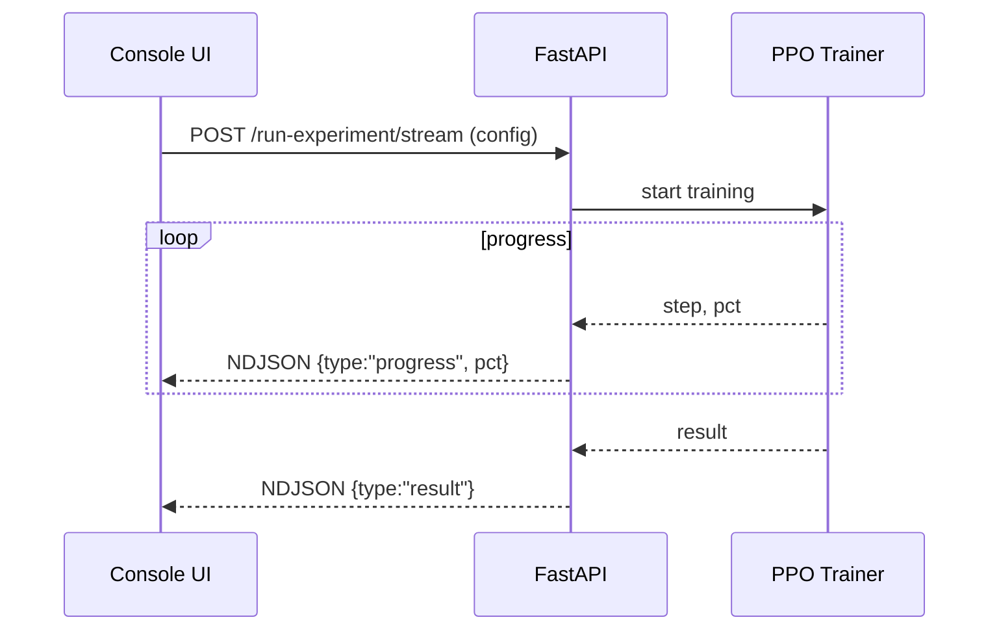
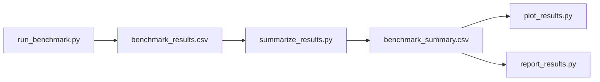
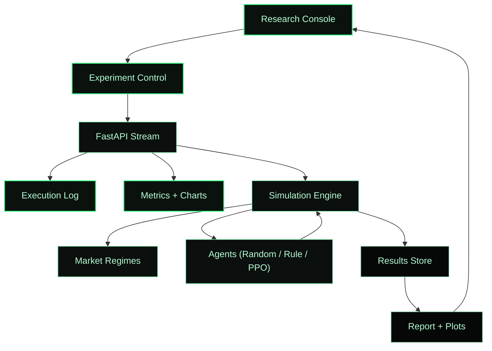
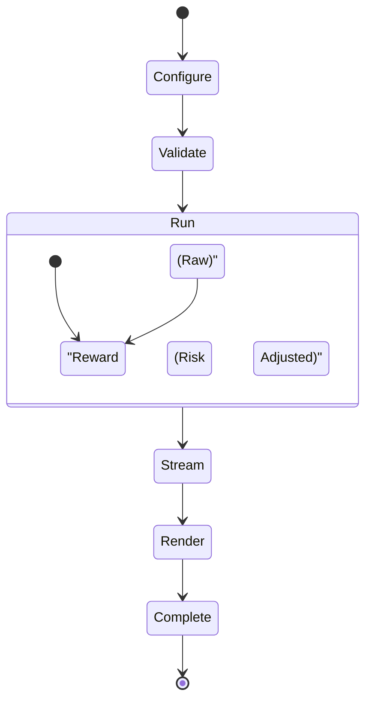

# Prosperity Grove

[](https://prosperity-grove.netlify.app)
[](https://prosperity-grove.onrender.com)
[](https://python.org)
[](https://fastapi.tiangolo.com)
[](https://react.dev)
[](LICENSE)

Prosperity Grove is an AI-powered financial decision-making simulator focused on long-term wealth behavior and risk dynamics. It combines a market simulator, baseline agents, PPO training, and a console-style UI for running and inspecting experiments.

**Core Objectives**
- Provide a controllable market simulator with multiple regimes.
- Compare baseline agents against PPO under raw and risk-adjusted rewards.
- Offer a reproducible benchmark pipeline for research reporting.
- Present results through a console UI with live progress and diagnostics.

**Key Capabilities**
- Market regime simulator with reward shaping and trade penalties.
- Agents: random, rule_based, buy_and_hold, PPO.
- Regime-shift benchmark + reporting utilities.
- Streaming experiment progress (NDJSON) in the UI.
- Live metrics, action mix, and trajectory visualization.

**Technology Stack**
- Backend: FastAPI, Python 3.11/3.12.
- RL: stable-baselines3 (PPO), gymnasium, torch.
- Data: numpy, pandas.
- Frontend: Vite, React, CSS animations.
- Deployment: Render (API) + Netlify (UI).

**UI Animations**
- Panel reveal: subtle fade + slide on load.
- Sparkline draw: animated path for the latest trajectory.
- Bar rise: action mix bars animate into place.
- Log fade: new log lines fade in for readability.

**Repository Layout**
- `backend/`: FastAPI service, agents, environments, simulations.
- `frontend/`: Vite + React research console.
- `experiments/`: scenarios, configs, and result tools.
- `docs/`: benchmark and architecture notes.

**Quickstart (Local)**
1. Backend
```
python3 -m venv .venv
source .venv/bin/activate
pip install -r backend/requirements.txt
uvicorn backend.app.main:app --host 0.0.0.0 --port 8000
```
2. Frontend
```
cd frontend
npm install
VITE_API_BASE=http://127.0.0.1:8000 npm run dev
```

**API Endpoints**
- `GET /` health check.
- `POST /run-experiment` returns a complete experiment result.
- `POST /run-experiment/stream` streams progress + result (NDJSON).

**Experiment Flow**


**Streaming Progress Flow**


**Benchmark Pipeline**


**Visual System Maps (Unique)**




**Benchmarking**
See `docs/benchmark.md` for the full workflow, including reporting and plot generation.
```
python3 experiments/run_paper_suite.py --episodes 5 --ppo-repeats 5 --error-bars
```

**Deployment (Render + Netlify)**
1. Render (backend)
- Build command: `pip install -r backend/requirements.txt`
- Start command: `uvicorn backend.app.main:app --host 0.0.0.0 --port $PORT`
2. Netlify (frontend)
- Base directory: `frontend`
- Build command: `npm run build`
- Publish directory: `dist`
- Env var: `VITE_API_BASE=https://<your-render-app>.onrender.com`

**Notes**
- Use Python 3.11 or 3.12 for compatibility with `torch` and `stable-baselines3`.
